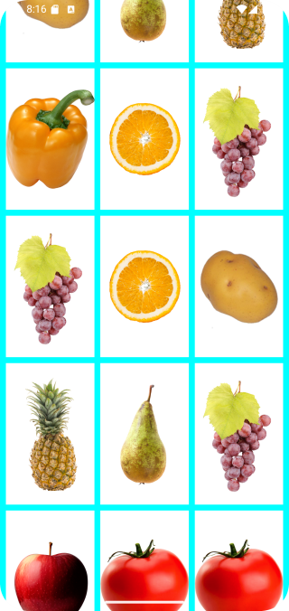
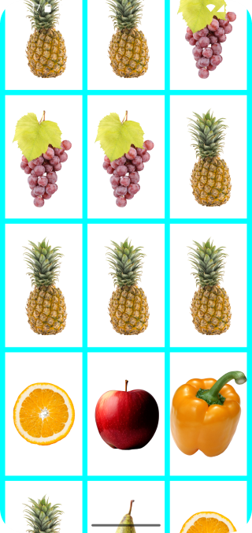

# Домашнее задание по теме "LazyHorizontalGrid, LazyVerticalGrid"

## Приложение «Удачное совпадение»

Необходимо написать приложение на основе пройденного материала, имитирующее игру, в которой получаешь выигрыш, если три картинки по горизонтали одинаковые.

Приложение содержит LazyVerticalGrid.

Список картинок включает не более 6 – 8 элементов, картинки могут быть разного содержания (фрукты, овощи, предметы обихода). LazyVerticalGrid размещает в себе эти картинки рандомно и должен вмещать в себя 100 штук.

Примерный вариант отображения содержимого может выглядеть так:

Приложение необходимо сохранить проектом в удаленном репозитории, для проверки качества предоставить ссылку преподавателю, либо сделать скрины эмулятора при каждом шаге работы приложения или снять видео экрана при работе приложения.

## Скриншоты домашнего задания по теме "LazyHorizontalGrid, LazyVerticalGrid"

